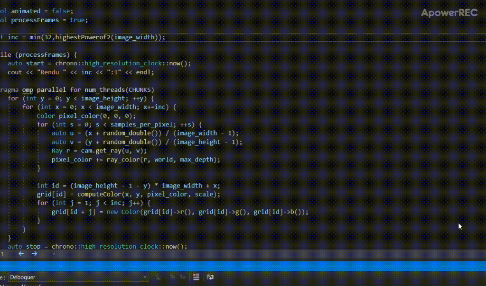
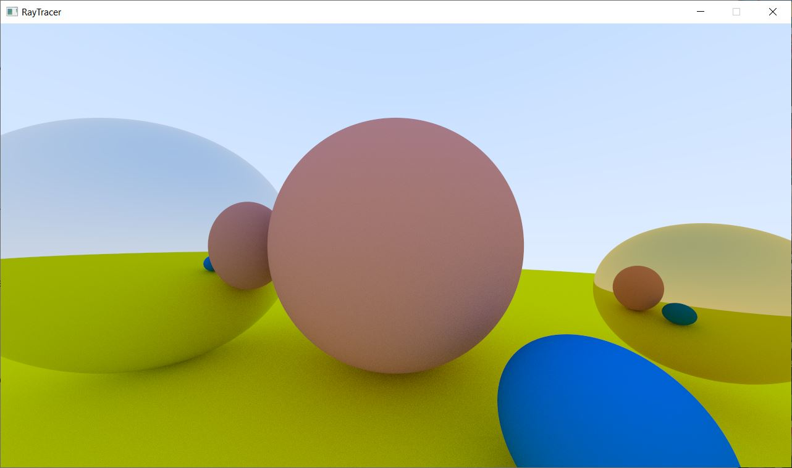
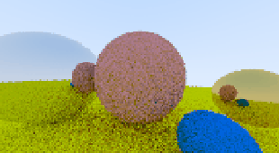

# Basic Ray tracer
A simple ray-tracer with animated rendering features, inspired by the book "RayTracing in one weekend" by Peter Shirley.
Written in C++(17) as a way of learning the magic behind Ray-tracing.

Currently Windows Only, you can try out the executable yourself. Please note that the calculations are very CPU-intensive.

I also made it numerous times faster with multi-threading, (usage of OpenMP). The project also greatly benefits from compiler (Ox) optimizations.

Pixels are written on a texture buffer and then sent to the GPU through the window (use of SDL) so we can benefit from having animated scenes in a windowed application. 
There is also the possibility to write the pixels directly onto the console, but I depreciated it in favor of the technique mentioned previously.

Go ahead and try the executable available in the v0.2 release ->

# Changelog (0.2) : 
- Revision of the parallelisation logic after taking a course on parallelisation techniques
- Updated the OpenMP logic to benefit from modern improvements of using OMP tasks
- Added dirty calculations to reuse heavy square root vector length

### About the use of tasks

OpenMP tasks were the way to easily solutionnate an issue I had with previous implementations. I was splitting the render between threads, iterating over sections of the image height. This technique worked, but the issue encountered was that the threads computing the upper parts of the image finished a lot faster than the threads computing the lower part of the image. This is simply because the scene had all of its objects in the bottom. 
Making use of tasks, firstly by telling to the main thread (omp single) to gather all the tasks, and then each one being picked up for computation, now allows for computation of a line of pixels to be made by any threads that has finished before the others.

## Previews

**Static renders**

Quick demo animation of my basic incremental resolution preview system (static image only)

This gives this smooth HD image render (... seconds) - (Using Lambertian diffuse properties) :

**Animated scene**

Settings used : 320x180 pixels with 5 samples

## Quick settings for trying it out

All of the below estimations are made with my current CPU : Ryzen 7 1700 @ 3.00Ghz.

Please note I restricted the image ratio to 16:9, so the user just has to enter the horizontal resolution. For example, if you want a 1280x720 image, you will just have to type 1280.

### Animated: (Animation loop = Y )

~ 45 frames per second animation

- Horizontal resolution : 100
- Samples : 10

~ 25 frames per second animation

- Horizontal resolution : 192
- Samples : 5

~ 12 frames per second animation

- Horizontal resolution : 300
- Samples : 5

~ 10 frames per second animation

- Horizontal resolution : 400
- Samples : 3

### Static: (Animation loop = N )

The static mode benefits from a progressively better quality preview.
**Quick HD preview**:
~  ... seconds at 1:1 resolution

- Horizontal resolution : 1280
- Samples : 10

**Smooth HD image**:
~ ... seconds at 1:1 resolution

- Horizontal resolution : 1280
- Samples : 100

**Smoother Full HD image**:
~ ... seconds at 1:1 resolution

- Horizontal resolution : 1920
- Samples : 200

## Things to come:

- Depth of field camera effect (with blur)
- Ability to move the camera using the mouse/keyboard
- Linux portability
- More shapes ? (Being able to render a triangle would allow for 3D model imports).
